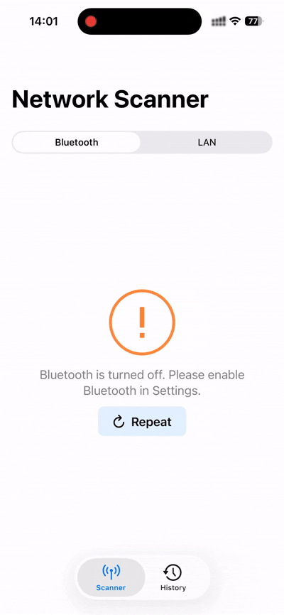
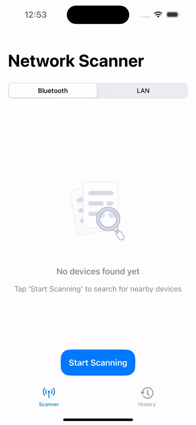
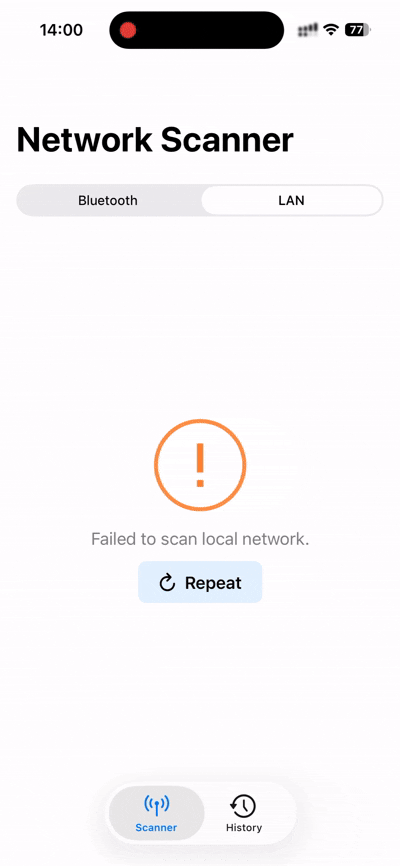

<p align="right"><a href="./README.md">English</a> | <b>Русский</b></p>

#  Network Scanner

<p align="left">
  
  
  
  
  
  
  
  
  
</p>

Мощная утилита для сканирования сети для iOS, созданная с использованием **SwiftUI** и архитектуры **MVVM**. Приложение предоставляет комплексные инструменты для обнаружения устройств в вашей локальной сети (LAN) с помощью **MMLanScan** и поиска ближайших устройств Bluetooth через **CoreBluetooth**. Проект отличается современным интерфейсом с анимациями **Lottie** и надежным хранением данных с помощью **CoreData**.

## ✨ Особенности

- **📡 LAN Сканер:** Быстрое обнаружение всех устройств, подключенных к вашей Wi-Fi сети, с использованием надежной библиотеки **MMLanScan**.
- **🔵 Bluetooth Сканер:** Поиск ближайших Bluetooth устройств, отображение уровня их сигнала (RSSI), статуса подключения и доступных сервисов с помощью **CoreBluetooth**.
- **💾 История и Хранение:** Автоматическое сохранение сессий сканирования в локальную базу данных **CoreData**. Фильтрация результатов по времени и имени устройства для удобного доступа.
- **📱 Детали Устройства:** Просмотр подробной технической информации о каждом обнаруженном устройстве.
- **🎨 Современный UI:** Чистый и отзывчивый интерфейс, дополненный плавными анимациями **Lottie**, включая специальный экран запуска.
- **� Жесты и Обновление:** Управляйте данными интуитивно с помощью жестов смахивания для удаления и функции pull-to-refresh.
- **⚡️ Быстрый Поиск:** Супер быстрый поиск, работающий напрямую с базой данных.
- **🛡️ Обработка Ошибок:** Комплексная обработка ошибок для обеспечения плавной работы приложения.

## 🖼️ Превью

| Разрешения (iOS 26.1) | Сканирование Bluetooth (iOS 26.1) | Ошибка Bluetooth (iOS 26.1) |
|:---:|:---:|:---:|
|  |  |  |

| Сканирование LAN (iOS 17.5) | Ошибка LAN (iOS 26.1) | История (iOS 17.5) |
|:---:|:---:|:---:|
|  |  |  |

## 🛠️ Технологии и Архитектура

Проект построен с использованием архитектурного паттерна **MVVM (Model-View-ViewModel)** для обеспечения разделения ответственности и тестируемости.

- **SwiftUI:** Для создания декларативного и отзывчивого пользовательского интерфейса.
- **CoreData:** Для локального хранения истории сканирований.
- **CoreBluetooth:** Для взаимодействия с устройствами Bluetooth Low Energy.
- **MMLanScan:** Мощная библиотека для обнаружения сетевых устройств.
- **Lottie:** Для рендеринга высококачественных векторных анимаций.
- **CocoaPods & SPM:** Используются для управления зависимостями.

## 🚀 Установка

Этот проект использует **CocoaPods** для некоторых зависимостей.

1. **Клонируйте репозиторий:**

   ```bash
   git clone https://github.com/teenagelove/NetworkScanner.git
   cd NetworkScanner
   ```

2. **Установите Pods:**

   ```bash
   pod install
   ```

3. **Откройте Workspace:**
   ⚠️ **Важно:** Всегда открывайте файл `.xcworkspace`, а не `.xcodeproj`.

   ```bash
   open NetworkScanner.xcworkspace
   ```

## 👥 Авторы

- [Danil Kazakov](https://github.com/teenagelove) - создатель и сопровождающий

## 📄 Лицензия

Этот проект доступен под лицензией MIT. Подробнее см. в файле LICENSE.
